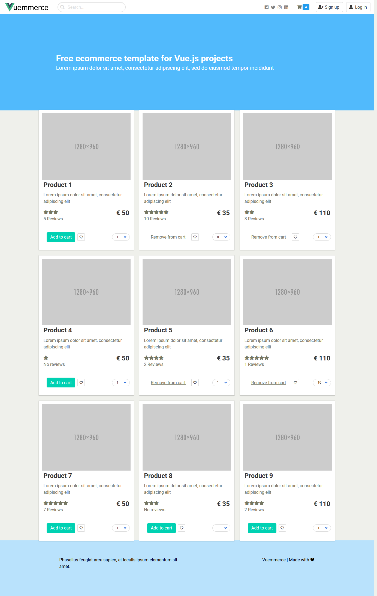

# Vuemmerce - Ecommerce Vue,nuxt&Bulma

VueCommerce Vue, Nuxt&Bulma

[](https://github.com/vuejs/vue)
)


---

## Installing

```
# clone repository
git clone https://github.com/aris-presley-aja/

# install dependencies
yarn install

# serve with hot reload at localhost:3000
yarn dev

# generate static pages via nuxt.js for static hosting
yarn build

```

---

## Screenshot



**[Template Demo](https://vuemmerce-git-master.Aris.now.sh/)**

---

## Authors

- **Aris Priyanto** - _Initial work_ - [ArisPriyanto](https://github.com/aris-presley-aja/)

---

## Contributing on Vuemmerce

Thanks for your interest!

To contribute, please ensure that you have stable Node.js and npm installed.

Follow the steps below.

1. Follow the [Installing](#installing) instructions
2. Check the open issues out
3. Create your branch with a reference to the open issue
4. Commit your changes
5. Open a pull request

If you have any questions, feel free to email me at [aris.22002.priyanto@gmail.com](mailto:aris.22002.priyanto@gmail.com).

---

## Changelog

See the release notes into [changelog.md](changelog.md)

---

## License

This project is licensed under the MIT License - see the [LICENSE.md](LICENSE.md) file for details
